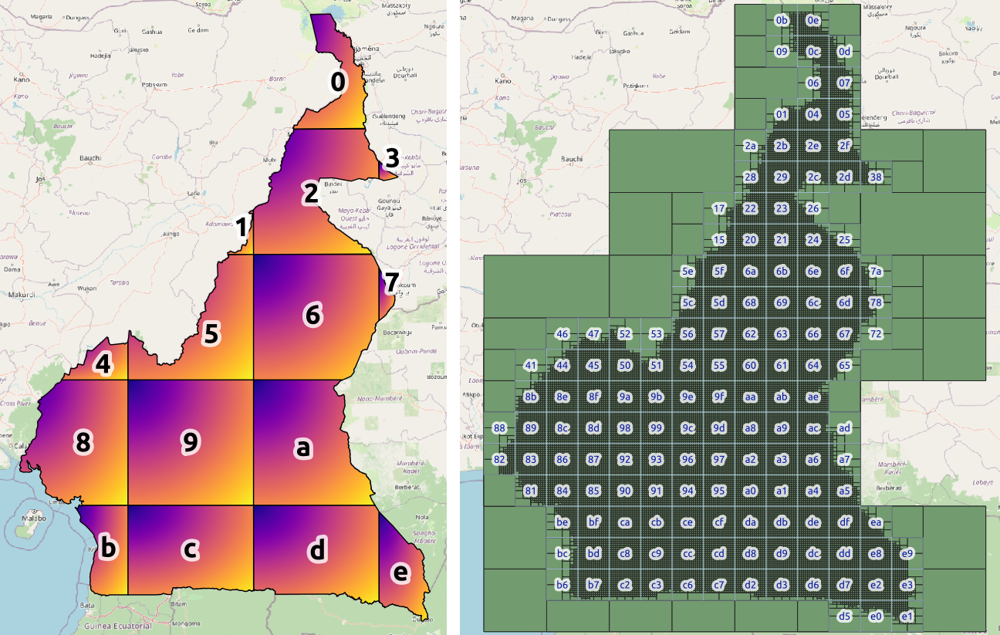

# CM

Cameroonian [AFA Codes](https://AFA.codes), officially incorporated as **BANOC** - *Base d'Adresses Numérique Ouverte du Cameroun*.

This repository serves as the "public part" of the *AFAcodes_gridGen-CM* configurations.  
The source code for the software *AFAcodes_gridGen-CM* will be generated here (under a `src` folder) by *AFAcodes-softwareGen* &mdash; the software generator system which generates the "AFA Codes System" software for specific countries. Both pieces of software are registered with [INPI](https://www.gov.br/inpi).

The `data-CC0` folder contains [CC0-licensed](https://creativecommons.org/public-domain/cc0/) data. The `data-licensed` folder contains data with [other Creative Commons license](https://en.wikipedia.org/wiki/Creative_Commons_license).

When the [`src` folder is present](src), the licenses and instructions in that folder must be followed.

Canonical URL for this repository: [git.AFA.codes/CM](https://git.AFA.codes/CM)

## Nominal geocodes of CM

Cameroon is assigned the following geocodes: in the [ISO&nbsp;3166](https://en.wikipedia.org/wiki/ISO_3166) context, the 2-letter abbreviation-code [**CM**](https://en.wikipedia.org/wiki/ISO_3166-2:CM) and the numeric code [**120**](https://en.wikipedia.org/wiki/ISO_3166-1_numeric). Other considered geocodes: in [Wikidata](https://wikidata.org), the identifier is [Q1009](http://wikidata.org/entity/Q1009); in [OpenStreetMap](https://osm.org), the *relation* ID is [192830](http://osm.org/relation/192830).

For administrative purposes, the national territory and its subdivisions represent *jurisdictions*:

- The country is divided into *10 regions* (formerly provinces). The geocodes for these regions follow the convention registered by [ISO&nbsp;3166&#8209;2:CM](https://en.wikipedia.org/wiki/ISO_3166-2:CM). In OpenStreetMap, the regions correspond to administrative level 4.

- The regions are further subdivided into *departments*, communes (*arrondissements*), and districts. There are a total of **360 subdivisions**, which are ISO&nbsp;3166&#8209;2:CM's third-level subdivisions. These are listed as official "extended ISO labels" in [`data-restricted/citycover.csv`](data-restricted/citycover.csv) (column `isolabel_ext`), forming a [hierarchical naming geocode system](https://en.wikipedia.org/wiki/Geocode#Hierarchical_naming) under the syntax `CM-$L2-$L3`.   Codes in the form `CM-$L2` represent the provinces, and `$L3` are expressed as CamelCase ASCII transcriptions of complete names without accents or separators.  Examples: `CM-SU-KyeOssi` for Kyé-Ossi, `CM-CE-Soa` for Soa, `CM-SU-Maan` for Ma'an.

## Grid-system geocodes

[Geocodes based on regular hierarchical grids](https://en.wikipedia.org/wiki/Geocode#Hierarchical_grids) can be encoded and decoded from latitude-longitude coordinates. They adhere to the [DNGS standard - Discrete National Grid Systems](https://inde.gov.br/simposio-16-anos/), a variation of the [ISO DGGS standard](https://www.iso.org/standard/32588.html) designed for national rather than global requirements.

Grid AFA Codes follow the DNGS standard. For Cameroon, they are defined in the `afaCode_definition` parameter in the [`conf.yaml` configuration file](conf.yaml). The grid system uses a refinement ratio of 2, subdividing parent cells into child cells. It starts with 16 squares, each 262.144 km on a side, covering Cameroon’s territory, as illustrated below. As "power of 2" codes, they are expressed using hexadecimal-like codes (*base 16h* representation).

Long grid-based geocodes, for example [`915a69ddS`](https://afa.codes/CM+915a69ddS), an address-point of 32 m², are difficult to transcribe or memorize by humans. It can be [shortened by context](https://en.wikipedia.org/wiki/Geocode#Shortening_grid-based_codes_by_context). DNGS suggests using nominal geocodes as context and, for human readability, adopts the compact [base 32](https://en.wikipedia.org/wiki/Base32) representation. The resulting notation (in the example `CM-SOA~B6MRD`), called "logistic geocode", is defined in the files [`citycover.csv`](data-restricted/citycover.csv), [`citycover_dust.csv`](data-restricted/citycover_dust.csv), and [`citycover_dustDEL.csv`](data-restricted/citycover_dustDEL.csv) in the `data-restricted` folder.

## Extended Geo URI

All "official geocodes" can be used with the [Extended Geo URI](https://afa.codes/_foundations/2sbide_poster-GeoURI-v2.pdf) protocol (described on [page 140 here](https://inde.gov.br/images/inde/ANAIS_2SBIDE.pdf)).

